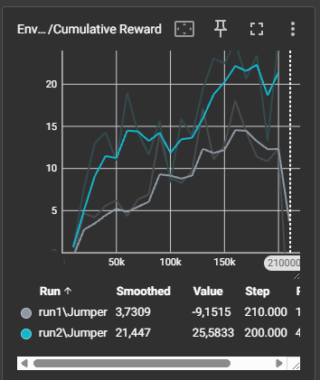
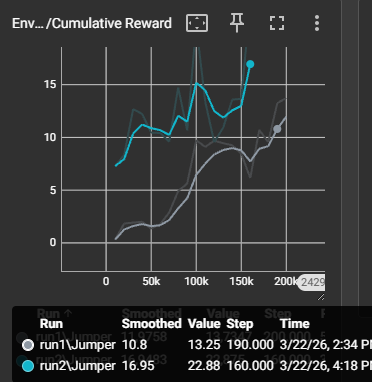
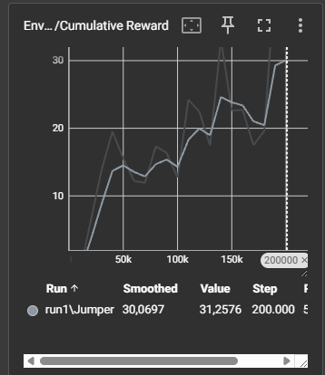
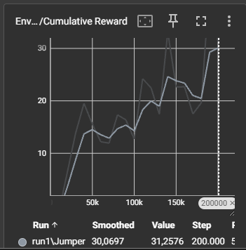

# Rapport Jumper

## Inleiding

In dit rapport staan de observaties aangaande de Jumper-oefening, waarbij een agent zal leren springen om over obstakels te raken of beloningen te gaan oprapen.

---

## Methode

Behavioural parameters: 1 discrete action = springen

Agent Override-methodes (veralgemeend van vier varianten):

```
OnEpisodeBegin(): resetten van de Agent positie en de velocity zodat
deze zeker op positie staat bij herstart.

CollectObservations(): z, y positie van agent.
1. z positie laat hem weten dat hij verschoven wordt door het obstakel
2. y positie weet dat hij van het platform gevallen is en of hij
   gesprongen heeft.
3. (coin jumper krijgt een observation van de coin Z positie)

OnActionReceived():
1. Een discreteAction voor het springen aangezien dit "aan/uit" is.
2. Springen maakt gebruik van een raycast en een ground layer om dubbele
   sprongen te voorkomen. Verder krijgt hij ook een standaard -0.5f reward
   bij het springen om constant springen voor niets te voorkomen.
3. Als hij van het platform valt krijgt hij ook een negatieve reward.

Rewards in triggerevents:
4. 5f als over de bovenkant gesprongen wordt.
5. Als hij de bovenkant raakt een -0.5f reward en eindigen van de episode.
6. Reward trigger geeft een reward van 5f (hierbij wordt de jump over
   reward 2f bij de start en bij de coin verhogen we de kans van een coin
   te spawnen naar 50%)

Heuristic(): voor het testen van de acties.
```

Extra functies:

```
EndEpisodeClean(): in de eerste trainingen clearde ik mijn overblijvende
obstacles via OnEpisodeBegin() en kreeg hierbij memory leaks. Nadat ik
deze heb aangepast om dit te doen voor het eindigen van de episode heb
ik deze warning niet meer voorgehad.

Naar mijn interpretatie gebeurde dit aangezien bij OnEpisodeBegin()
alles eigenlijk al gecleared werd, maar deze nog wel op een soort van
manier in het geheugen bleven staan, waardoor de objecten eigenlijk
niet echt konden vernietigd worden.
```

---

## Omgeving

De omgeving bestaat uit een agent met raycasts, een ondergrond die de layernaam Ground gebruikt om double jumps te voorkomen. Verder zijn er ook nog vier soorten prefabs:

**Obstacle:** Bevat 2 hitboxes
1. *over*: hierbij zal hij een reward krijgen voor over het obstakel te springen.
2. *top*: hierbij zal hij een negatieve reward verkrijgen voor hierop te landen.

**Obstacle2Side:** Deze bevat dezelfde elementen van het eerste obstakel, maar met de top een beetje verschoven naar de voorzijde, zodat de episode stopt en hij een negatieve reward krijgt bij geraakt te worden door een obstakel.

**ObstacleReward:** hierbij krijgt hij een positieve reward voor het bewegen door het obstakel en een negatieve voor erover springen.

**Coin:** Is een item; als deze opgenomen wordt, wordt een positieve reward gegeven.

---

## Resultaten

**Jumper varying speed:**
Deze werkt al redelijk goed, maar durft soms op/tegen de obstacles te landen. Hij springt wel bij elk obstakel.


**Jumper obstacles 2 side:**
Hij heeft soms meer moeite met obstacles die van één zijde komen dan met de andere.


**Jumper reward wall:**
Hij kan meestal over de nodige muren springen en is in staat een reward wall op te nemen.


**Jumper with coins:**
De agent is in staat om elke coin op te nemen, maar heeft soms ook moeite met het springen over obstacles.


---

## Struikelblok

Ik heb lang vastgezeten op een punt waarbij mijn Unity-omgeving vastkwam te zitten en geen enkel teken van een error toonde, niet in Unity en niet in Event Viewer van Windows. Na lang zoeken bleek dit het model te zijn dat nog op de agent stond en dat dit veroorzaakte.

---

## Conclusie

In het begin bij "Jumper Varying Speed" is me niet opgevallen dat de agent kan double jumpen door middel van hitboxes. Dit heb ik nadien opgelost door een ground layer aan de raycast toe te voegen, waardoor hij alleen kan springen wanneer hij op deze ground layer staat.

Waarom is het springen over muren nog niet altijd even succesvol? Ik denk dat dit voorkomt doordat ik met een variërende snelheid werk die tussen de 7f en 20f ligt, wat dus een trainingscurve zal tonen waarbij we in een stijgende lijn met dalen en pieken de agent kunnen zien verbeteren.

---
---

# Rapport Hunter

## Inleiding

In dit rapport bekijken we hoe twee agents kunnen leren in een omgeving waarbij ze tegen elkaar opspelen. Het doel hiervan is bekijken hoe we dit kunnen afstemmen, hoe maken we hier nu een  .yaml voor en wat voor resultaten levert dit nu op.

Ik wil in deze training ook werken zonder observations, enkel het gebruik van ray perception 3D.

---

## Methode

Behavioural parameters: 2 continuous actions: voorwaarts-achterwaarts; linksdraaien-rechtsdraaien

Agent Override-methodes:

```
OnEpisodeBegin(): opzetten van omgeving
1. random locaties van de objecten
2. random locatie van de Hunter (EvilAgent)
3. random locatie van de opraper (GrabberAgent)

CollectObservations(): geen, enkel Ray Perception 3D

OnActionReceived():

Hunter (EvilAgent):
1. -0.0005f reward als tijdspenalty
2. -3f reward als alle objecten opgeraapt zijn
Rewards in trigger events:
3. 6f voor het vangen van "GrabberAgent"
4. -1f voor het raken van een muur

Objectenopraper (GrabberAgent):
1. -0.0005f penalty voor tijd te nemen
2. 10f reward voor het oprapen van alle objecten
Rewards in trigger events:
3. 2f reward voor het oprapen van een object
4. -2f voor het gevangen worden door de Hunter
5. -1f voor het aanraken van een muur

Heuristic(): voor het testen van de acties.
```

Extra functies:

```
SpawnObj(): aanmaken van objecten op random locaties.

GetSpawn(): hulpfunctie voor het aanmaken van objecten en het random
spawnen van beide agents op een locatie.
```

---

## Omgeving

Platform met 4 muren met de tag "Wall", waarbinnen dynamisch de agents en objecten gespawned worden.

---

## Resultaten

We zien een duidelijke "field advantage" bij de Hunter, wat redelijk logisch is, aangezien deze gewoon op het pad en ook op de cube zelf kan gaan staan om deze te beschermen tegen de Grabber. Alhoewel de Hunter (EvilAgent) vaak kan winnen, kan de GrabberAgent ook soms trucjes proberen gebruiken, zoals langs de Hunter gaan zodat deze achter hem aan gaat en het object dan vrijkomt om op te pakken. Dit kunnen we ook in de rewards zien:

```
[INFO] EvilAgent. Step: 320000. Time Elapsed: 6900.827 s. Mean Reward: 5.864. Std of Reward: 0.717. Training.
[INFO] GrabberAgent. Step: 320000. Time Elapsed: 6901.408 s. Mean Reward: 0.749. Std of Reward: 2.689. Training.
[INFO] EvilAgent. Step: 325000. Time Elapsed: 7017.518 s. Mean Reward: 5.915. Std of Reward: 0.167. Training.
[INFO] GrabberAgent. Step: 325000. Time Elapsed: 7017.553 s. Mean Reward: -0.327. Std of Reward: 2.275. Training.
[INFO] EvilAgent. Step: 330000. Time Elapsed: 7134.954 s. Mean Reward: 5.875. Std of Reward: 0.690. Training.
[INFO] GrabberAgent. Step: 330000. Time Elapsed: 7134.971 s. Mean Reward: -0.266. Std of Reward: 2.685. Training.
[INFO] EvilAgent. Step: 335000. Time Elapsed: 7246.347 s. Mean Reward: 5.863. Std of Reward: 0.724. Training.
[INFO] GrabberAgent. Step: 335000. Time Elapsed: 7246.370 s. Mean Reward: -0.073. Std of Reward: 2.735. Training.
```

En in de grafieken zien we ook het duidelijke punt waarop de Hunter begint te behrijpen hoe hij snel aan reward komt.


#### Hoe zou ik deze opdracht nog interessanter maken?

- Door voordelen te bieden aan de GrabberAgent.
- Het vergroten van het speelveld, zodat er meer ruimte is om weg te bewegen.
- Het introduceren van power-ups voor beide agents (speed boosts, power-up waardoor de andere kwetsbaar wordt, zoals de power pellet in Pac-Man).
- Een complexer speelveld.
- pick-up objecten geven een negatieve reward aan EvilAgent.

---

## Conclusie

In deze oefening konden we zien hoe twee agents tegen elkaar ingaan en hun strategieën ontwikkelen om tot een goede reward te komen, zoals het wachten en patrouilleren in de buurt van de objectives door de EvilAgent, en hoe de GrabberAgent langs de wanden navigeert en vanaf daar soms probeert objecten op te nemen doorheen de training of de EvilAgent probeert af te leiden van het object die deze aan het beschermen is.
We zien wel dat de EvilAgent een fieldAdvantage heeft aangz-ezien deze weinig te verliezen heeft.

Ik denk als we deze nog verder hadden laten trainen we mischien nog nieuwe taktieken hadden kunnen zien, de trainings curve is heel gevarieerd en zal waarschijnlij lang duren tot deze vlak komt (mede omdat rey perception 3D de enige observatie).

---

## Eigen ingeving

Hoewel er maar één opdracht verplicht was, heb ik ervoor gekozen ook de "Hunter"-oefening uit te werken. Het concept van twee agents die tegen elkaar leren en op elkaar reageren leek me interessant om in een praktische zin te bekijken.

## Totaal rapport
Ik ben niet voor één perfect werkende Agent gegaan en heb meerdere verschillende alternatieven van de opdracht geprobeert omdat dit mij een interessantere opdracht leek. Ik denk als ik alle trainingen die ik tot nu toe gedaan heg nog iets langer laat draaien dat (vooral bij de jumper oefening) de agents een regelmatige output zullen geven.