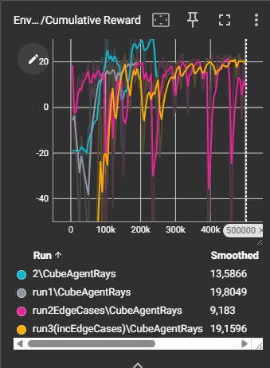
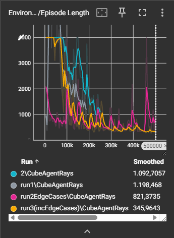
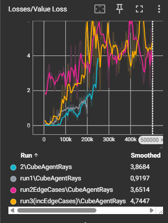

## Rapport Obelix-opdracht

## Inleiding

Dit rapport gaat over de werking en observaties van een agent die getraind wordt verschillende stenen (= menhirs) op te nemen en af te leveren aan de leveringszone. Het rapport kan mijzelf een overzicht bieden van de gebruikte observatiemethodes en een overzicht van de gebruikte methodes/aangepaste waarden die in het code-/yaml-bestand gebruikt zijn. Dit wordt onderzocht, omdat dit een uitbreiding is die we al op de basis van agenttraining hebben gezien.


---

## Methode


Behavioural parameters: 2 continues actions = rotatie en voorwaartse/achterwaartse beweging en in yaml-file aangepast, zodat de time horizon langer was.

Agent Override-methodes:

``` 
OnEpisodeBegin(): reset de agent en spawnt menhirs op willekeurige plaatsen en een
leverzone, deze menhirs hebben een 20% kans om nabij muren te spawnen waardoor er
een edgecase werd opgelost die zich in eerdere trainingen bevond.

CollectObservations(): kijkrichting, de hasMenhir status(=deze helpt zodat hij weet
ah als deze true is en ik bots dan krijg ik een negative reward). En ook de
relatieve positie van deze leverzone omdat deze soms moeite had om deze goed te
bereiken tijden voorgaande traingen.

OnActionReceived(): Verwert de acties van rotatie en bewegingen en verkrijgt hier de
volgende (negative-)rewards

1. Tijd penalty van -0.005 voor er te lang over te doen.
2. Reward 6f voor alle menhirs te leveren.
3. levering reward van 4f +
4. reward voor oppakken van menhir van 2f
5. negatieve reward van -4 voor botsen met menhir als reeds een menhir heeft.
6. negatieve reward van -0.001f voor het botsen met muur (niet gebruikt in finaale versie)

Heuristic(): voor het testen van de acties.

```

---

## Resultate

drie varianten van training:

1. training zonder barriers met ogen naar beneden gericht: De agent (Obelix) speelt safe door zoveel mogelijk tussen de menhirs te blijven. Er worden redelijk vaak succesvolle leveringen gedaan, valt nooit van de map. problemen:

    - Zoals eerder verwoord: onzekerheid. Waarom gebeurt dit nu? Bij de vorige opdracht, vanwege de vaste leverpositie, kon de agent zich relativeren tegenover de hitbox van de leverzone en ook het pakket dat deze wil afleveren, en het doel was redelijk makkelijk. Omdat deze nu verplicht wordt ruim te exploreren, creëert hij onzekerheid om te vallen, aangezien niet elke menhir op dezelfde plek staat, dus = geen relatief punt.

    Nu hiervoor dacht ik: "Als ik de rays een beetje naar beneden richt, dan weet hij waar de grond is. Dit verbeterde de training in de vorige opdracht ook". Dit lost het probleem een klein beetje op, maar nu is het probleem de manier waarop deze rays werken. Het is eigenlijk zo dat hij meer info haalt uit iets dat te zien is dan dat iets niet te zien is (= creëert noise), dus volgende stap eens met muren trainen.
    - De agent vermeed ook geen menhirs als hij er al één droeg.

2. training met barriers: training verliep veel sneller, hij ging sneller de menhirs leren opnemen tegenover de vorige versie. Hij kon ook alleen maar focussen op de levering, aangezien er geen uitweg is voor de negatieve reward voor tijd te nemen. de finale versie werkte redelijk oké. problemen:

    - kon soms vast komen te zitten op de laatste menhir, meestal als deze in een hoek stond. Ik was niet zeker of dit door een muur was of de oplopende negatieve reward als menhir raakt als agent al een menhir draagt, of beide. 

    - Raakte ook nog altijd menhirs als hij er één droeg, zoals ervoor, dus dat spreekt dan weer een beetje mijn vorige punt van de laatste menhir tegen.

3. training met barriers en een vergroot aantal edge cases: Men kan een heel snel trainingsproces zien waarbij de agent snel bijleert. Naarmate de training langer doorgaat, weet hij beter te navigeren als menhir's in hoeken en dicht tegen de zijkant staan. De agent vermijdt niet altijd menhir's als hij er één vast heeft, maar probeert dit nu wel meer te doen tegenover de twee voorgaande trainingen. Verder lijkt er een hoge efficiëntie te zijn bij het opnemen en afleveren van de menhirs.

volgende grafieken tonen de traingsruns:

We kunnen hier heel duidelijk zien dat bij de run3 met de edge cases goed verdeeld dat deze veel stabielere resultaten tegen het einde geeft.




---
Ik wil hierbij ook nog een klein beetje toevoegen over ray receptors en hoe deze naar mijn interpretatie het beste gebruikt kunnen worden om een AI-agent te laten trainen: In onze situatie, waarbij we een AI wensen die we trainen en dan uiteindelijk in een gelijke situatie laten werken. dan lijkt het me best geen ray receptors te gebruiken en de wereldpositie van alle objecten mee te geven als we efficiëntie wensen.

Ray-receptoren kunnen heel nuttig zijn voor een algemenere AI, zodat deze zelf in een totaal nieuwe omgeving (als er gevarieerd genoeg getraind is) kan navigeren en zijn taken kan uitvoeren.

Ik heb tijdens mijn tweede training ook mijn yaml-file aangepast, omdat hij dan beslissingen over een langere tijd neemt, want pickup > levering kan enige tijd duren. Dit geeft hem meer denktijd over de acties die hij over een tijd gaat doen.

---

## Conclusie

Uit deze opdracht heb ik verder geleerd hoe nu de ray receptors van Unity werken, waarbij dus niks = noise en moeilijke anticipatie voor het inschatten van een afgrond, en dit kan ook een deel onzekerheid creëren.

training op extra edge cases help om de agend veel stabieler te kunnen laten werken.

Verder kunnen kleine aanpassingen in de yaml-file training versnellen en ervoor zorgen dat de agent efficiënter en betere bewegingen maakt.


---

## Referentie


